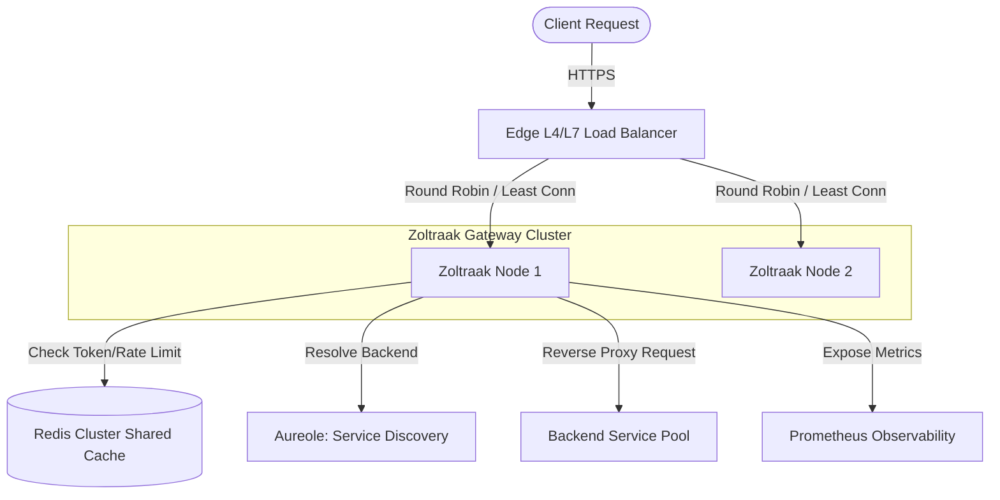
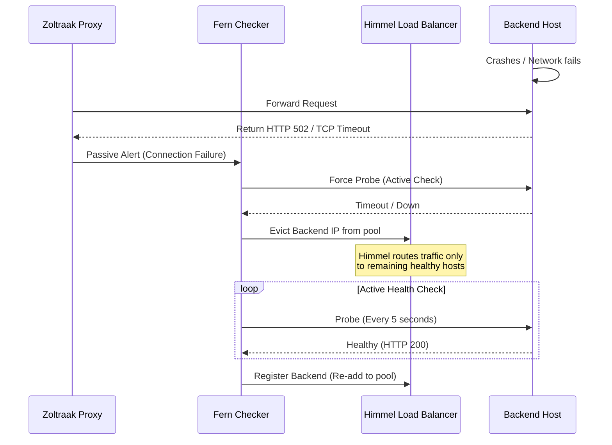

# Zoltraak: Production-Grade Distributed API Gateway Architecture Blueprint

Zoltraak is a high-performance, distributed, and configuration-driven API Gateway designed to handle high-throughput edge routing, authentication, and traffic control. Named after the primary offensive magic in the *Frieren* universe, Zoltraak acts as the shields and spears of our backend architecture.

This document outlines the end-to-end design, data models, concurrency mechanisms, and structural implementation blueprint.

---

## 1. High-Level Architecture

The Zoltraak Gateway operates as an edge or tier-2 load-balancing proxy layer. It is designed to run in a stateless, horizontally scaled cluster behind an edge load balancer (such as an AWS ALB, Cloudflare, or Maglev-based L4 load balancer).

### 1.1 Request Lifecycle and Data Flow



### 1.2 System Boundaries & Architecture Topology

```
+---------------------------------------------------------------------------------+
|                                 CLIENT LAYER                                    |
|             Mobile Apps, Web Apps, Third-Party API Clients                      |
+---------------------------------------------------------------------------------+
                                      |
                                      v (HTTPS / HTTP2)
+---------------------------------------------------------------------------------+
|                         EDGE INFRASTRUCTURE (L4/L7 LB)                          |
|             SSL/TLS Termination, DDoS Protection, IP Whitelisting               |
+---------------------------------------------------------------------------------+
                                      |
                                      v (Internal Network / VPC)
+---------------------------------------------------------------------------------+
|                            ZOLTRAAK GATEWAY NODES                               |
|   +-------------------------------------------------------------------------+   |
|   | [Zoltraak Node A] (Go Process)                                          |   |
|   |  - Spellbook (YAML Config)                                              |   |
|   |  - Grimoire (Routing Engine)                                            |   |
|   |  - ManaWall (Redis Rate Limiter)  <---+                                 |   |
|   |  - Flamme (Circuit Breakers)          |                                 |   |
|   |  - Fern (Active & Passive Health)     |                                 |   |
|   |  - Himmel (Load Balancers)            |                                 |   |
|   |  - Stark (Exponential Retry)          |                                 |   |
|   |  - Chronicle (Prometheus Metrics)     |                                 |   |
|   +---------------------------------------|---------------------------------+   |
|                                           |                                     |
+-------------------------------------------|-------------------------------------+
                                            |
                       +--------------------+--------------------+
                       | (Redis Protocol)                        | (HTTP/gRPC)
                       v                                         v
+---------------------------------------+ +---------------------------------------+
|          REDIS CLUSTER LAYER          | |        BACKEND SERVICE POOL           |
|  - Sliding Window Logs                | |  - User Service                       |
|  - Token Bucket Leases                | |  - Order Service                      |
|  - API Key Metadata Cache             | |  - Payment Service                    |
+---------------------------------------+ +---------------------------------------+
```

### 1.3 Components & Roles
1. **Edge Load Balancer**: Terminates external SSL/TLS, filters Layer-4 attacks, and distributes incoming requests across the Zoltraak gateway nodes.
2. **Zoltraak Nodes**: Stateless Go processes running net/http servers. Each node acts independently for routing, circuit breaking, and load balancing, while utilizing the Redis cluster to synchronize rate limiting counters and auth state.
3. **Redis Cluster**: Distributed, high-performance in-memory cache used as the centralized source of truth for rate limits and API key blacklists. It prevents "split-brain" rate limit issues across gateway nodes.
4. **Backend Services**: Downstream microservices. Zoltraak routes requests here, dynamically tracking health and connection state.

### 1.4 Failure Domains and Isolation
- **Node Isolation**: If a Zoltraak node crashes, the Edge Load Balancer automatically evicts it. The remaining nodes handle the traffic.
- **Redis Outage**: A Redis failure will not bring down the gateway. Zoltraak uses a **fallback policy** (configurable to fail-open or fail-secure) where it degrades to local in-memory rate limiting when Redis is unavailable.
- **Backend Degradation**: If a specific backend service goes down, its circuit breaker (**Flamme**) opens locally on each gateway node to prevent cascading latency and resource depletion.

---

## 2. Folder Structure

A production Go layout following clean architecture, segregating domain interfaces, implementation code, configuration logic, and deployment specifications.

```
zoltraak/
├── cmd/
│   └── gateway/
│       └── main.go                 # Application entrypoint
├── internal/
│   ├── app/
│   │   └── gateway.go              # Main Zoltraak engine composition
│   ├── config/
│   │   ├── config.go               # Spellbook structures
│   │   └── loader.go               # Spellbook parser
│   ├── engine/
│   │   ├── proxy/
│   │   │   └── proxy.go            # Custom ReverseProxy wrapping net/http/httputil
│   │   ├── router/
│   │   │   └── grimoire.go         # Grimoire: Route matching & trie routing
│   │   ├── middleware/
│   │   │   ├── auth.go             # API Key verification middleware
│   │   │   ├── ratelimit.go        # ManaWall rate limiter middleware
│   │   │   ├── circuitbreaker.go   # Flamme circuit breaker middleware
│   │   │   ├── retry.go            # Stark retry integration middleware
│   │   │   └── metrics.go          # Chronicle observability middleware
│   │   ├── ratelimit/
│   │   │   ├── manawall.go         # ManaWall rate limiter interface & Redis client
│   │   │   └── lua.go              # Redis Lua scripts (Token Bucket, Sliding Window)
│   │   ├── circuitbreaker/
│   │   │   └── flamme.go           # Flamme circuit breaker engine
│   │   ├── health/
│   │   │   └── fern.go             # Fern Active/Passive health check system
│   │   ├── loadbalancer/
│   │   │   └── himmel.go           # Himmel load balancers (RR, WRR, LC)
│   │   ├── retry/
│   │   │   └── stark.go            # Stark exponential retry loop with jitter
│   │   ├── discovery/
│   │   │   └── aureole.go          # Aureole: Service registry integrations (Consul/DNS)
│   │   └── metrics/
│   │       └── chronicle.go        # Chronicle: Prometheus registry & custom metrics
│   └── pkg/
│       └── logger/
│           └── zap.go              # Shared production structural logging setup (Zap wrapper)
├── pkg/
│   └── sdk/                        # Optional external-facing clients/plugins
├── configs/
│   ├── default.yaml                # Standard gateway configuration
│   └── security.yaml               # API keys configuration
├── deployments/
│   ├── Dockerfile
│   ├── docker-compose.yaml
│   ├── prometheus/
│   │   └── prometheus.yml
│   └── grafana/
│       └── provisioning/
└── scripts/
    └── benchmark.sh                # Load testing scripts
```

### Folder Responsibilities:
- **`cmd/`**: Contains execution entrypoints. `main.go` instantiates components, loads configurations, handles OS signals for graceful shutdown, and executes the server block.
- **`internal/`**: Private application code. Not importable by external packages.
  - **`app/`**: Composes high-level server modules together, wiring up net/http.
  - **`config/`** (`Spellbook`): Parsing files, dynamic configuration updates, validating structures.
  - **`engine/`**: The core API gateway engines.
    - **`proxy/`**: Oversees low-level network operations, HTTP request modifications, response writing, connection pooling, and timeouts.
    - **`router/`** (`Grimoire`): Manages route matching, fast lookup trees (trie), wildcard processing, and route parameters.
    - **`middleware/`**: Request preprocessing logic intercepting connections prior to proxy routing.
    - **`ratelimit/`** (`ManaWall`): Token Bucket/Sliding Window implementations using Redis.
    - **`circuitbreaker/`** (`Flamme`): Thread-safe state machines protecting downstream systems.
    - **`health/`** (`Fern`): Periodically sends requests to backend services to verify health.
    - **`loadbalancer/`** (`Himmel`): Algorithms to determine which backend service to route the request to.
    - **`retry/`** (`Stark`): Automatically retries failed requests based on custom retry configurations.
    - **`discovery/`** (`Aureole`): Dynamic endpoint resolving interface.
    - **`metrics/`** (`Chronicle`): High-performance Prometheus counter updates.
- **`pkg/`**: Public utility libraries that can be shared externally.
- **`deployments/`**: System infrastructure definitions. Dockerfiles, Compose setups, Kubernetes specs, configurations for observability.

---

## 3. Module-by-Module Breakdown

```
                         +-----------------------+
                         |      Spellbook        | (Configuration)
                         +-----------------------+
                                     |
                                     v
+---------------------------------------------------------------------------------+
|                                    Zoltraak                                     |
|                               (Gateway Context)                                 |
|                                                                                 |
|   +-------------------------------------------------------------------------+   |
|   |                                Grimoire                                 |   |
|   |                            (Routing Engine)                             |   |
|   +-------------------------------------------------------------------------+   |
|                                    |                                            |
|                                    v (Middleware Chain)                         |
|   +-------------------------------------------------------------------------+   |
|   |  ManaWall (Rate Limiter) -> Flamme (Circuit Breaker) -> Stark (Retry)   |   |
|   +-------------------------------------------------------------------------+   |
|                                    |                                            |
|                                    v                                            |
|   +-------------------+  +-------------------+  +------------------------+      |
|   |      Himmel       |  |       Fern        |  |        Aureole         |      |
|   |  (Load Balancer)  |  |  (Health Checker) |  |  (Service Discovery)   |      |
|   +-------------------+  +-------------------+  +------------------------+      |
|                                    |                                            |
+------------------------------------|--------------------------------------------+
                                     v
                           +-------------------+
                           |     Chronicle     | (Metrics & Observability)
                           +-------------------+
```

### 3.1 Zoltraak (Main Engine)
- **Purpose**: Server entry point, configuration bootstrapping, handling incoming TCP connections, context propagation, and coordinate graceful shutdown.
- **Key Interface**:
```go
type Gateway interface {
    ListenAndServe(addr string) error
    Shutdown(ctx context.Context) error
}
```
- **Internal Flow**: `Zoltraak` reads initial configurations, launches the `Fern` health daemon, starts Prometheus collectors under `Chronicle`, spins up `net/http` servers, and routes requests to `Grimoire`.
- **State Management**: Holds pointers to the router registry, active connections, and the globally shared context.
- **Concurrency**: Spin up independent goroutines under `net/http` for incoming requests. Graceful shutdown uses `sync.WaitGroup` to track processing queries.

### 3.2 Grimoire (Routing Engine)
- **Purpose**: Parses config routing tables, implements a radix trie pattern matching engine, checks HTTP verbs, handles path parameters, and injects route metadata into request context.
- **Key Interface**:
```go
type RouteMatcher interface {
    Match(req *http.Request) (*Route, error)
    Register(route Route) error
}
```
- **Internal Flow**: For every request, Grimoire checks the URL path against registered routes. Returns structural metadata including headers to inject, downstream cluster identifiers, and middleware overrides.
- **State Management**: Read-heavy trie structure. Utilizes atomic pointer swapping (`sync/atomic`) to swap routing tables at runtime without lock contention.
- **Concurrency**: Thread-safe reads. Read locks (`sync.RWMutex`) or atomic swaps protect changes during config reloads.

### 3.3 ManaWall (Rate Limiter)
- **Purpose**: Multi-level rate limiting (IP-based, API Key-based, Route-based) using distributed memory.
- **Key Interface**:
```go
type RateLimiter interface {
    Allow(ctx context.Context, key string, limit int, window time.Duration) (bool, *RateLimitResult, error)
}

type RateLimitResult struct {
    Allowed   bool
    Limit     int
    Remaining int
    ResetIn   time.Duration
}
```
- **Internal Flow**: Extracts client keys, executes Redis Lua script, evaluates response, and injects `X-RateLimit-*` headers.
- **State Management**: Centralized counters in Redis. Local fallback cache (e.g., LFU-based cache) in memory if Redis goes offline.
- **Concurrency**: Uses Go Redis Client with thread-safe connection pools.

### 3.4 Flamme (Circuit Breaker)
- **Purpose**: Stop propagating traffic to downstream backends that are failing, allowing them time to recover.
- **Key Interface**:
```go
type CircuitBreaker interface {
    Execute(ctx context.Context, operation func() (interface{}, error)) (interface{}, error)
    State() State
}
```
- **Internal Flow**: Wraps HTTP backend forwarding. Checks state. If `Open`, aborts immediately returning `HTTP 503`. If `Closed`, forwards request, incrementing success/failure tallies.
- **State Management**: Tracks failures and success rates over time windows. Transitions between `Closed`, `Open`, and `Half-Open`.
- **Concurrency**: Uses `sync.Mutex` and atomic variables (`sync/atomic`) to guarantee state-transition safety across multiple concurrent requests.

### 3.5 Fern (Health Checker)
- **Purpose**: Continuously monitors backend instances, marking down failing instances and restoring healthy ones.
- **Key Interface**:
```go
type HealthChecker interface {
    Start(ctx context.Context)
    IsHealthy(backendURI string) bool
    RegisterListener(listener HealthEventListener)
}
```
- **Internal Flow**: Periodically hits health endpoints (Active Check) and watches response codes of production requests (Passive Check).
- **State Management**: Maintains status map of all registered backend IPs.
- **Concurrency**: Background ticker-driven goroutines for active checks. RWMutex or concurrent maps to expose health states to the router and load balancer.

### 3.6 Himmel (Load Balancer)
- **Purpose**: Load-balances proxy requests across healthy backend pools.
- **Key Interface**:
```go
type LoadBalancer interface {
    Next(ctx context.Context, req *http.Request) (string, error)
    UpdateTargets(targets []string)
}
```
- **Internal Flow**: Intercepts request, retrieves healthy targets from the pool, runs election algorithm (e.g., Round Robin, Least Connections), and returns the downstream destination.
- **State Management**: Keeps target list weights and request counters.
- **Concurrency**: Protects index pointer loops and active connection metrics using atomic operations or mutex locks.

### 3.7 Stark (Retry Engine)
- **Purpose**: Retries failed proxy calls safely, preventing cascading failures.
- **Key Interface**:
```go
type RetryEngine interface {
    Do(ctx context.Context, operation func() (*http.Response, error)) (*http.Response, error)
}
```
- **Internal Flow**: Tracks call results. If an idempotent endpoint fails with an eligible HTTP status (e.g., 502, 503, 504) or connection error, Stark sleeps for `backoff + jitter` and retries.
- **State Management**: Stateless per request; reads retry configurations from the request context.
- **Concurrency**: Relies on `time.After` and Go `context` cancellation to abort early if the request is canceled by the client.

### 3.8 Aureole (Service Discovery)
- **Purpose**: Dynamically resolves downstream service addresses via DNS, Consul, or etcd, feeding them to Himmel.
- **Key Interface**:
```go
type ServiceDiscovery interface {
    Watch(serviceName string) (<-chan []string, error)
}
```
- **Internal Flow**: Watches dynamic service catalogs, receives updates, and triggers Himmel backend pool updates.
- **State Management**: Local cache of resolved service addresses.
- **Concurrency**: Background polling or long-poll streams emitting updates over channel abstractions.

### 3.9 Chronicle (Metrics and Observability)
- **Purpose**: Gathers and exports Prometheus metrics, handles structured trace-level request logging.
- **Key Interface**:
```go
type MetricsTracker interface {
    RecordRequest(route string, method string, status int, duration time.Duration)
    RecordRateLimitReject(route string, keyType string)
    RecordCircuitState(backend string, state string)
}
```
- **Internal Flow**: Observability middleware intercepts requests and updates Prometheus counters and histograms in memory.
- **State Management**: Delegated to Prometheus Client's memory-mapped accumulators.
- **Concurrency**: Highly parallel; uses Prometheus' built-in thread-safe collector constructs.

### 3.10 Spellbook (Config System)
- **Purpose**: Parses configuration structures, validates inputs against rules, and watches for runtime reloads.
- **Key Interface**:
```go
type ConfigLoader interface {
    Load() (*Config, error)
    Watch(ctx context.Context, onChange func(*Config))
}
```
- **Internal Flow**: Loads configs from YAML. Starts filesystem watchers (e.g., fsnotify) to detect updates, validate them, and trigger hot reloads.
- **State Management**: Holds active parsed configurations.
- **Concurrency**: Protects hot-reload swaps with atomic pointers, preventing write conflicts with ongoing request reads.

---

## 4. Reverse Proxy Design

The reverse proxy forms the execution engine of Zoltraak, built upon `httputil.ReverseProxy`.

### 4.1 Custom Proxy Pipeline

```
Client Request -> [Director] -> [Transport / Connection Pool] -> [ModifyResponse] -> Client Response
                     |                                              |
                     +--> Path Rewrite                              +--> Passive Health Check
                     +--> Header Injection                          +--> Prometheus Metrics
                     +--> Host Preservation                         +--> Circuit Breaker Tracking
```

### 4.2 Implementation Design Elements

#### Request Forwarding and Director Hook
Using a custom `Director` function in `httputil.ReverseProxy` to modify the incoming request before forwarding:
- **Path Rewriting**: Strip path prefixes based on match configs (e.g., `/api/v1/users/login` rewritten to `/users/login` on the backend).
- **Header Forwarding**:
  - Inject standard proxies headers: `X-Forwarded-For`, `X-Forwarded-Proto`, and `X-Request-ID` (for tracing).
  - Clean incoming requests of internal headers (e.g., `X-Zoltraak-Internal-*`).
- **Host Preservation**: Make `req.Host` configurable. Some backends require the host to match the destination server address, while others need the client's original host.

#### Transport Pooling
To prevent resource exhaustion (socket starvation), Zoltraak configures a custom `http.RoundTripper`:
```go
var CustomTransport = &http.Transport{
    Proxy: http.ProxyFromEnvironment,
    DialContext: (&net.Dialer{
        Timeout:   5 * time.Second,   // Connection timeout
        KeepAlive: 30 * time.Second,  // TCP Keep-Alive
    }).DialContext,
    MaxIdleConns:          10000,             // Total idle connections across all targets
    MaxIdleConnsPerHost:   100,               // Prevent socket exhaustion for high-volume backends
    IdleConnTimeout:       90 * time.Second,  // Time to drop idle connections
    TLSHandshakeTimeout:   5 * time.Second,   // TLS Handshake timeout
    ExpectContinueTimeout: 1 * time.Second,
}
```

#### ModifyResponse and Error Handling Hooks
- **`ModifyResponse`**: Sniff response codes. If a status matches failure filters (e.g., `5xx` errors), notify the passive health checker (**Fern**) and circuit breaker (**Flamme**).
- **`ErrorHandler`**: Intercept connection timeouts or target resets, and format responses into clean structured JSON formats:
```json
{
  "error": "Service Unavailable",
  "request_id": "8c5c56d7-e23a-4ba9-9e8c-55447b850d99",
  "status_code": 503
}
```

---

## 5. Redis Data Model & Algorithms

Distributed rate limiting requires atomic checks to handle high concurrent traffic volumes. Zoltraak implements two algorithms: Token Bucket and Sliding Window.

### 5.1 Token Bucket Algorithm
- **Data Model**:
  - Hash Key: `ratelimit:token_bucket:{route_id}:{client_identifier}`
  - Hash Fields:
    - `tokens`: Float64 (Current tokens remaining)
    - `last_updated`: Integer (Unix timestamp in milliseconds)

#### Lua Script Execution
To prevent race conditions, the following Lua script runs atomically inside Redis:
```lua
local key = KEYS[1]
local limit = tonumber(ARGV[1])
local rate = tonumber(ARGV[2]) -- tokens per millisecond
local now = tonumber(ARGV[3]) -- current time in ms
local cost = tonumber(ARGV[4] or 1)

local data = redis.call('HMGET', key, 'tokens', 'last_updated')
local tokens = tonumber(data[1])
local last_updated = tonumber(data[2])

if not tokens then
    tokens = limit
    last_updated = now
else
    local elapsed = now - last_updated
    tokens = math.min(limit, tokens + elapsed * rate)
    last_updated = now
end

if tokens >= cost then
    tokens = tokens - cost
    redis.call('HMSET', key, 'tokens', tokens, 'last_updated', last_updated)
    redis.call('PEXPIRE', key, math.ceil((limit - tokens) / rate))
    return {1, math.floor(tokens)}
else
    redis.call('HMSET', key, 'tokens', tokens, 'last_updated', last_updated)
    return {0, math.floor(tokens)}
end
```

### 5.2 Sliding Window Log Algorithm
- **Data Model**:
  - Key: `ratelimit:sliding_window:{route_id}:{client_identifier}`
  - Type: Sorted Set (ZSET)
  - Member: Unique ID (UUID/Timestamp)
  - Score: Unix timestamp in milliseconds

#### Lua Script Execution
```lua
local key = KEYS[1]
local now = tonumber(ARGV[1])
local window = tonumber(ARGV[2]) -- window size in milliseconds
local limit = tonumber(ARGV[3])
local clear_before = now - window

-- Remove old elements
redis.call('ZREMRANGEBYSCORE', key, 0, clear_before)

-- Count current elements
local current_requests = redis.call('ZCARD', key)

if current_requests < limit then
    redis.call('ZADD', key, now, now .. '_' .. math.random())
    redis.call('PEXPIRE', key, window)
    return {1, limit - current_requests - 1}
else
    return {0, 0}
end
```

### 5.3 Security Key Storage
- **Data Model**:
  - Key: `apikey:{key_hash}`
  - Type: Hash
  - Fields:
    - `client_id`: `usr_98231`
    - `metadata`: `{"tier":"premium", "roles":["reader","writer"]}`
    - `status`: `active` (or `revoked`)
  - **TTL Strategy**:
    - Valid keys have no TTL (or long-term TTL of e.g. 30 days, refreshed on hit).
    - Revoked keys are stored in a distributed Bloom Filter or as explicit keys with short TTLs to prevent invalid access before the local cache syncs.
    - Local memory cache within Zoltraak (using a thread-safe LRU cache with eviction logic) caches API keys for 60 seconds to avoid querying Redis on every incoming request.

---

## 6. Load Balancer Design (Himmel)

`Himmel` routes traffic across healthy backend endpoints, using three load balancing strategies:

### Round Robin (RR)
- **Algorithm**: Tracks the last-used index and increments it atomically using modulo arithmetic: `index = atomic.AddUint64(&lastIdx, 1) % healthy_backends_length`.
- **Performance**: $O(1)$ time complexity, minimal lock contention.

### Weighted Round Robin (WRR)
- **Algorithm**: Implements the LCG (Linear Congruential Generator) or Interleaved WRR. Each backend instance has a dynamic weight configuration.
- **State Management**:
  - `current_weight`: Tracks current relative scale weights.
  - `gcd`: Greatest common divisor of weights.
  - `max_weight`: Highest target weight.

### Least Connections (LC)
- **Algorithm**: Selects backend with the lowest number of active requests.
- **State Management**:
  - In-memory tracker map: `map[string]*int64` representing the active connection counts for each backend instance.
  - When the reverse proxy processes a request:
    1. Selects backend with the lowest connection count.
    2. Atomically increments connection count: `atomic.AddInt64(&backend.activeConns, 1)`.
    3. Executes request.
    4. Decrements connection count inside a `defer` block: `atomic.AddInt64(&backend.activeConns, -1)`.

### 6.1 Backend State Tracking and Failover
- If a target endpoint health state changes via `Fern`'s notifications, the pool of targets is dynamically swapped using atomic pointers.
- **Graceful Failover**: If the selected backend fails with a connection error during routing:
  1. The load balancer marks that instance unhealthy.
  2. The gateway retries the request (**Stark**) on a different backend target returned by `Himmel`.

---

## 7. Circuit Breaker Design (Flamme)

`Flamme` isolates failing downstream backends to prevent resource exhaustion and cascading failures.

### 7.1 State Machine Transition Model

```
       +---------------------------------------------+
       |                                             |
       v                                             | Success Count > Threshold
+--------------+        Failures > Threshold        +-----------+
|    Closed    | ---------------------------------> |   Open    |
+--------------+                                    +-----------+
       ^                                                 |
       |                                                 | Open Timeout Expired
       |                                                 v
       |               Failure Hit                  +-----------+
       +------------------------------------------- | Half-Open |
                                                    +-----------+
```

### 7.2 State Characteristics
1. **Closed**: Normal operations. Requests pass directly downstream.
   - Every failure increments a sliding-window failure counter.
   - If the failure rate exceeds `FailureRateThreshold` (e.g., 50% failures within a rolling window of 10s or 100 requests), transition to `Open`.
2. **Open**: Traffic blocks immediately. Downstream targets are bypassed, returning `503 Service Unavailable` to the client.
   - Starts a cooldown timer (`OpenTimeout`, e.g., 30 seconds).
   - Once expired, transition to `Half-Open`.
3. **Half-Open**: Slowly probes downstream systems.
   - Permits a limited number of test requests (e.g., 10 requests).
   - If **any** probe fails, return to `Open` state and restart cooldown timer.
   - If all test requests succeed, return to `Closed` state.

### 7.3 Data Structures
```go
type State int32

const (
    StateClosed State = iota
    StateOpen
    StateHalfOpen
)

type CircuitBreakerConfig struct {
    Name             string
    MinRequests      int32         // Min requests inside sliding window before calculation
    FailureThreshold float64       // E.g. 0.50 (50%)
    CooldownPeriod   time.Duration // Time spent in Open state before Half-Open
    ProbeThreshold   int32         // Requests allowed in Half-Open to qualify recovery
}
```

---

## 8. Health Check Design (Fern)

`Fern` keeps the load balancer updated with backend health statuses.

### 8.1 Active Health Checking (Background Agent)
- Running background goroutines with `time.Ticker` intervals.
- Sends health checks (e.g., HTTP `GET /health` or TCP dialing) to target backends.
- **Failures to Unhealthy**: If $N$ consecutive health checks fail, the backend is marked **unhealthy**.
- **Successes to Healthy**: If $M$ consecutive health checks succeed, the backend is marked **healthy**.

### 8.2 Passive Health Checking (Inline Interceptor)
- Snipe codes returned from live client requests flowing through the proxy.
- If a target returns a network timeout, socket error, or consecutive HTTP `502`/`503` responses, the passive check triggers an early status check instead of waiting for the active checker's next interval.

### 8.3 Eviction and Recovery Lifecycle



---

## 9. Retry Engine (Stark)

Retrying failed operations helps recover from transient network blips but risks causing a **retry storm** if downstream servers are overloaded.

### 9.1 Exponential Backoff with Jitter
- **Formula**:
  $$t_{\text{backoff}} = \min(t_{\text{max}}, t_{\text{initial}} \times 2^{\text{attempt}})$$
  $$t_{\text{sleep}} = \text{random}(0, t_{\text{backoff}})$$
- Jitter randomizes intervals to prevent multiple gateway instances from querying downstream hosts simultaneously.

```go
func CalculateBackoff(attempt int, initial, max time.Duration) time.Duration {
    backoff := float64(initial) * math.Pow(2, float64(attempt))
    if backoff > float64(max) {
        backoff = float64(max)
    }
    // Full Jitter
    jitter := rand.Float64() * backoff
    return time.Duration(jitter)
}
```

### 9.2 Retry Budgets
To prevent cascading resource consumption, Zoltraak tracks a **token bucket-based Retry Budget**:
- Maintains a bucket of retry tokens per route (e.g., maximum 100 tokens).
- Every successful normal request adds `0.1` tokens.
- Every retry attempt consumes `1.0` token.
- If the token count falls below `1.0`, **no more retries are attempted** for that route. The gateway forwards the backend's failure response directly to the client. This limits the total retry overhead to a maximum of 10% of baseline traffic.

---

## 10. Complete Request Lifecycle

An end-to-end trace of a request through the Zoltraak gateway nodes:

```
[Client Request]
       │
       ▼
 1. [TCP Connection Accepted] (TLS Terminated by Edge, Zoltraak receives HTTP)
       │
       ▼
 2. [Middleware: Request ID Injection] (X-Request-ID Header generated/assigned)
       │
       ▼
 3. [Middleware: API Key Validation]
       ├── Query local LRU cache
       └── Fallback: Query Redis. If missing/revoked -> return HTTP 401 Unauthorized
       │
       ▼
 4. [Middleware: ManaWall Rate Limiter]
       ├── Execute sliding window lookup in Redis
       └── If exceeded -> return HTTP 429 Too Many Requests
       │
       ▼
 5. [Grimoire Router Match]
       ├── Search path trie
       └── Resolve destination downstream cluster name
       │
       ▼
 6. [Himmel Load Balancer Target Election]
       ├── Fetch list of healthy hosts for resolved cluster
       └── Elect host (e.g. Host B via Least Connections)
       │
       ▼
 7. [Flamme Circuit Breaker State Check]
       └── Check status for Host B. If OPEN -> return HTTP 503 Service Unavailable
       │
       ▼
 8. [Stark Retry Wrapper]
       └── Initialize request trial count
             │
             ▼
       9. [Proxy Forwarding via ReverseProxy]
             ├── Path rewritten, headers updated
             ├── Execute network I/O
             └── Result Evaluator
                   ├── Success (HTTP 2xx/3xx/4xx) -> return response to client
                   └── Failure (HTTP 502/503/504 or I/O error)
                         ├── Decrement Retry Budget. If depleted -> return response
                         ├── Calculate Backoff + Jitter sleep
                         └── Elect new host from Himmel -> Re-enter step 8
```

---

## 11. Go Concurrency Model

Zoltraak is built to handle high concurrency using Go's lightweight runtime scheduler (goroutines).

### 11.1 Concurrency Patterns
- **Request Goroutines**: Each request runs on its own HTTP worker goroutine. All shared resource access is lock-free or uses fine-grained read-write locks (`sync.RWMutex`).
- **Dynamic Configuration Hot Reload**:
  - Uses `atomic.Value` or `unsafe.Pointer` to store the active routing trie.
  - When configuration updates, a single worker goroutine compiles the new configuration, then executes `atomic.Value.Store(newGrimoireTrie)`.
  - Ongoing request goroutines load the configuration using `atomic.Value.Load()`, avoiding mutex contention.

### 11.2 Graceful Shutdown Flow
1. Receive termination signal (`SIGTERM` / `SIGINT`).
2. Stop accepting new connection requests. Stop edge load-balancer health checks to signal upstream systems to stop sending traffic.
3. Keep processing current requests with a timeout window (e.g., 15-30 seconds).
4. Cancel root context (`context.WithCancel`), alerting background daemons (like active health checkers and service discovery channels) to terminate cleanly.
5. Close active database pools (Redis connections).
6. Exit gateway process safely.

```go
func GracefulShutdown(server *http.Server, redisClient *redis.Client, cleanupTimeout time.Duration) {
    sigChan := make(chan os.Signal, 1)
    signal.Notify(sigChan, syscall.SIGINT, syscall.SIGTERM)
    <-sigChan // Block until signal is received

    log.Info("Shutdown signal received. Shutting down gateway...")

    ctx, cancel := context.WithTimeout(context.Background(), cleanupTimeout)
    defer cancel()

    // Stop accepting requests, wait for active connections to close
    if err := server.Shutdown(ctx); err != nil {
        log.Error("Forced shutdown executed", zap.Error(err))
    }

    // Terminate shared connections
    if err := redisClient.Close(); err != nil {
        log.Error("Error closing Redis client connections", zap.Error(err))
    }
    
    log.Info("Zoltraak gateway shut down gracefully.")
}
```

---

## 12. Failure Scenarios

| Failure Scenario | Impact | Mitigation Strategy |
| :--- | :--- | :--- |
| **Redis Outage** | Rate limits check fails, token lookups block. | **Fail-Open with Local Fallback**: Degrade to local, in-memory sliding window counters. Limits are enforced per-node instead of cluster-wide. |
| **Backend Service Outage** | Requests return timeout/502. | **Flamme (Circuit Breaker)**: Detects failures and trips the breaker. Subsequence traffic returns immediate `503` responses, saving proxy connection sockets. |
| **Slow Backend** | Request goroutines hang, exhausting threads. | **Tight Timeout Limits**: Enforce strict connection and response read timeouts. Clean up hung connections before they exhaust the file descriptors. |
| **Network Partition** | Gateway nodes cannot talk to Redis or dynamic discovery. | **Local Configuration Cache**: Fallback to local routing files and DNS caches. Continue routing traffic based on the last known healthy state. |
| **Retry Storms** | Cascading traffic spikes overwhelm backend hosts. | **Retry Budgets + Jitter**: Restrict retries to a max percentage of baseline traffic (e.g., 10%) and randomize backoffs. |
| **Gateway Node Crash** | Loss of node hosting traffic. | **Horizontal Scaling + Health Checks**: Keep nodes stateless. The edge L4/L7 load balancer drops unresponsive nodes within seconds. |

---

## 13. YAML Configuration Design (Spellbook)

The gateway config file defining routes, endpoints, policies, and circuit parameters:

```yaml
version: "1.0"
gateway:
  name: zoltraak-prod
  port: 8080
  admin_port: 9090
  graceful_shutdown_timeout: "15s"

services:
  - id: user_service
    name: User microservice API
    discovery: dynamic
    aureole_service_name: prod.user.service
    static_endpoints:
      - "http://10.0.1.10:8081"
      - "http://10.0.1.11:8081"
    load_balancer:
      strategy: least_connections # round_robin, weighted_round_robin, least_connections
    health_check:
      path: "/health"
      interval: "5s"
      timeout: "2s"
      unhealthy_threshold: 3
      healthy_threshold: 2

routes:
  - id: get_users
    path: "/api/v1/users/*"
    method: "GET"
    service_id: user_service
    strip_prefix: "/api/v1"
    timeout: "3s"
    rate_limiting:
      enabled: true
      strategy: sliding_window # token_bucket, sliding_window
      limit: 100
      window: "1m"
      client_key: "api_key" # ip, api_key, jwt_claim
    circuit_breaker:
      enabled: true
      min_requests: 20
      failure_threshold: 0.50
      cooldown_period: "30s"
      probe_threshold: 10
    retry:
      enabled: true
      max_attempts: 3
      initial_backoff: "100ms"
      max_backoff: "2s"
```

---

## 14. Metrics Design (Chronicle)

Zoltraak exposes key Prometheus metrics to track gateway health and performance.

### Metric Definitions

| Metric Name | Type | Labels | Description |
| :--- | :--- | :--- | :--- |
| `zoltraak_http_requests_total` | Counter | `route`, `method`, `status` | Total requests processed by the gateway. |
| `zoltraak_http_request_duration_seconds` | Histogram | `route`, `service_id` | End-to-end request latencies. |
| `zoltraak_rate_limit_rejected_total` | Counter | `route`, `key_type` | Total requests dropped by rate limits. |
| `zoltraak_backend_failures_total` | Counter | `service_id`, `endpoint`, `reason` | Downstream connection and HTTP errors. |
| `zoltraak_retry_attempts_total` | Counter | `route`, `service_id`, `attempt` | Total retry attempts. |
| `zoltraak_circuit_breaker_state` | Gauge | `service_id`, `state` | Current circuit breaker state (0=Closed, 1=Half-Open, 2=Open). |
| `zoltraak_backend_health_status` | Gauge | `service_id`, `endpoint` | Host health state (1=Healthy, 0=Unhealthy). |

---

## 15. Development Roadmap

```
+------------------------------------------------------------------------------------------+
| MILESTONE 1-3: Routing & Parsing                                                         |
| [M1: Reverse Proxy] ──> [M2: Config Loader] ──> [M3: Routing Engine]                     |
+------------------------------------------------------------------------------------------+
                                     │
                                     ▼
+------------------------------------------------------------------------------------------+
| MILESTONE 4-6: Traffic Management                                                        |
| [M4: Rate Limiting] ──> [M5: Load Balancers] ──> [M6: Circuit Breakers]                  |
+------------------------------------------------------------------------------------------+
                                     │
                                     ▼
+------------------------------------------------------------------------------------------+
| MILESTONE 7-10: Resilience & Production                                                   |
| [M7: Health Check] ──> [M8: Retry Engine] ──> [M9: Metrics] ──> [M10: Production Hardening]|
+------------------------------------------------------------------------------------------+
```

### Milestone 1: Core Reverse Proxy Engine
- **Implementation Order**: Implement basic Go net/http server, customize `httputil.ReverseProxy` transport pooling configuration, and set up JSON error handlers.
- **Dependencies**: None.
- **Expected Output**: A running HTTP server that forwards all incoming traffic to a single hardcoded target backend.
- **Test Plan**: Start local backend server mock (using `httptest.NewServer`). Verify that calling Zoltraak proxies requests to the target, preserving headers and forwarding payloads.

### Milestone 2: Config System (Spellbook)
- **Implementation Order**: Write configuration struct definitions, write YAML parsing parser, and write path config validation checks.
- **Dependencies**: Milestone 1.
- **Expected Output**: Config structs populated correctly from local YAML configuration files.
- **Test Plan**: Write validation test cases. Verify configuration parsing fails with informative errors when missing fields (like port definitions) or given invalid configuration durations.

### Milestone 3: Routing Engine (Grimoire)
- **Implementation Order**: Implement routing trie logic, write middleware chaining mechanisms, and write prefix strip functions.
- **Dependencies**: Milestone 2.
- **Expected Output**: Dynamic routing matching based on path parameters and HTTP methods.
- **Test Plan**: Run benchmarks for route matching. Write tests validating route priorities (e.g., matching `/api/v1/users/active` before the wildcard route `/api/v1/users/*`).

### Milestone 4: Distributed Rate Limiter (ManaWall)
- **Implementation Order**: Set up Go Redis connection pool pooler, import Lua rate limiting scripts, and write middleware limits checks.
- **Dependencies**: Milestone 3.
- **Expected Output**: Requests hitting defined endpoints are intercepted and rate-limited. Returns HTTP `429` status codes with rate limiting headers when limits are exceeded.
- **Test Plan**: Set up a local test Redis instance. Run parallel test cases to verify key limits are enforced correctly under load, and verify local fallback mechanisms trigger when Redis goes offline.

### Milestone 5: Load Balancer (Himmel)
- **Implementation Order**: Implement Round Robin, Weighted Round Robin, and Least Connections load balancing algorithms.
- **Dependencies**: Milestone 3.
- **Expected Output**: Rotates request routes across multiple backend targets.
- **Test Plan**: Spin up three backend HTTP instances. Verify request distribution matches the configured load balancer strategies under concurrent traffic load.

### Milestone 6: Circuit Breaker (Flamme)
- **Implementation Order**: Implement thread-safe state machine logic, write error trackers, and write state transition timers.
- **Dependencies**: Milestone 5.
- **Expected Output**: Breakers trip when target error rates spike. Bypasses backends and fails fast.
- **Test Plan**: Introduce errors on one target backend. Verify that the breaker trips to the `Open` state, and returns to `Closed` state after the configured cooldown period and successful test probes.

### Milestone 7: Health Checker (Fern)
- **Implementation Order**: Implement background dynamic check loop, write active HTTP ping checks, and write passive interceptor checks.
- **Dependencies**: Milestone 6.
- **Expected Output**: Dynamically flags and evicts unhealthy backend hosts from load balancer target pools.
- **Test Plan**: Shut down one of the target backends during operation. Verify the health checker evicts it within the configured unhealthy threshold window and re-registers it once it comes back online.

### Milestone 8: Retry Engine (Stark)
- **Implementation Order**: Implement exponential backoff calculate function, write full jitter sleep calculations, and write token-based retry budget engines.
- **Dependencies**: Milestone 7.
- **Expected Output**: Automated, safe retries on healthy backend targets for failed idempotent requests.
- **Test Plan**: Mock backend timeouts on specific requests. Verify retry triggers back off exponentially with random jitter, and verify retries are skipped once the retry budget limit is exceeded.

### Milestone 9: Metrics (Chronicle)
- **Implementation Order**: Set up Prometheus metrics exporter, write custom metrics middleware, and map status tracking logs.
- **Dependencies**: Milestone 8.
- **Expected Output**: Exposes a `/metrics` scrape endpoint listing operational metrics like latencies and request counters.
- **Test Plan**: Run performance requests against the gateway. Scrape `/metrics` to verify that values increment correctly and latency distribution is mapped.

### Milestone 10: Production Hardening
- **Implementation Order**: Implement file system config change observers, write graceful shutdown logic, and configure production-grade Zap logging fields.
- **Dependencies**: Milestone 9.
- **Expected Output**: Production-grade API Gateway ready for high-throughput traffic.
- **Test Plan**: Send SIGTERM signals to running processes under active request load. Verify no connections are dropped and active requests complete processing before the gateway terminates.

---

## 16. Testing Strategy

Maintaining reliability under high load requires a multi-layered testing strategy:

```
+-------------------------------------------------------------------------+
|                              CHAOS TESTING                              |
|           Jepsen (Redis partitions), Network latency injection          |
+-------------------------------------------------------------------------+
                                     ▲
                                     │
+-------------------------------------------------------------------------+
|                              LOAD TESTING                               |
|        k6 / Vegeta (High throughput concurrency, memory leaks)          |
+-------------------------------------------------------------------------+
                                     ▲
                                     │
+-------------------------------------------------------------------------+
|                           INTEGRATION TESTING                           |
|        Spin up Redis + Mock Backends via testcontainers-go              |
+-------------------------------------------------------------------------+
                                     ▲
                                     │
+-------------------------------------------------------------------------+
|                              UNIT TESTING                               |
|      100% Core coverage (trie routing, rate limiter Lua, backoffs)     |
+-------------------------------------------------------------------------+
```

- **Unit Testing**: Target core algorithmic components (e.g. Grimoire routing tries, Stark backoff, Flamme state transitions) with 100% test coverage. Mock `net.Conn` and `http.ResponseWriter` using standard `net/http/httptest`.
- **Integration Testing**: Use `testcontainers-go` to spin up ephemeral Redis containers during test execution. Test end-to-end middleware chain processing: `Client Request -> Auth -> Rate Limit -> Proxy`.
- **Concurrency Testing**: Run tests with the Go Race Detector (`go test -race`). Run tests with hundreds of concurrent goroutines calling shared modules (like load balancers and circuit breakers) to ensure thread safety.
- **Load Testing**: Use tools like `k6` or `vegeta` to stress test the gateway at high req/sec (10k+ RPS). Profile memory and CPU allocations using `go tool pprof` to check for leaks.
- **Chaos Testing & Failure Injection**: Simulate real-world production issues:
  - Inject latency into backend mock responses to verify timeouts and circuit breakers.
  - Abruptly terminate Redis nodes during rate-limiting operations to ensure local fallback systems trigger without dropping requests.
  - Interrupt network interfaces to verify node failovers.

---

## 17. Production Deployment Blueprint

A reference architecture for running Zoltraak at scale.

### 17.1 Containerization (Dockerfile)
Uses a multi-stage Docker build to keep images lightweight and secure.

```dockerfile
# Stage 1: Build the binary
FROM golang:1.22-alpine AS builder
WORKDIR /app
COPY go.mod go.sum ./
RUN go mod download
COPY . .
RUN CGO_ENABLED=0 GOOS=linux GOARCH=amd64 go build -ldflags="-w -s" -o zoltraak ./cmd/gateway/main.go

# Stage 2: Final minimal runtime image
FROM alpine:3.19
RUN apk --no-cache add ca-certificates tzdata
WORKDIR /app
COPY --from=builder /app/zoltraak .
COPY configs/default.yaml ./configs/
USER 65534:65534
EXPOSE 8080 9090
ENTRYPOINT ["./zoltraak", "-config", "./configs/default.yaml"]
```

### 17.2 Horizontal Scaling and Production Considerations
- **Gateway Replicas**: Deploy Zoltraak nodes as a stateless DaemonSet or Deployment in Kubernetes. Use Horizontal Pod Autoscaler (HPA) targeting CPU utilization (e.g., 70% threshold) and active connections.
- **Load Balancing Tier**: Place a Layer 4 Load Balancer (like AWS NLB or Maglev) in front of the Zoltraak cluster to balance connections with minimal latency overhead.
- **Shared Storage**: Deploy a highly-available Redis Cluster with read replicas. Configure Zoltraak to read from replicas and write to masters for rate limiting and API key checks.
- **Connection Tuning**: Tune host OS kernel parameters on Zoltraak instances for high throughput:
  ```bash
  # Increase maximum open files (file descriptors)
  ulimit -n 65535
  # Enable TCP fast open and recycle sockets
  sysctl -w net.ipv4.tcp_tw_reuse=1
  sysctl -w net.core.somaxconn=32768
  ```
